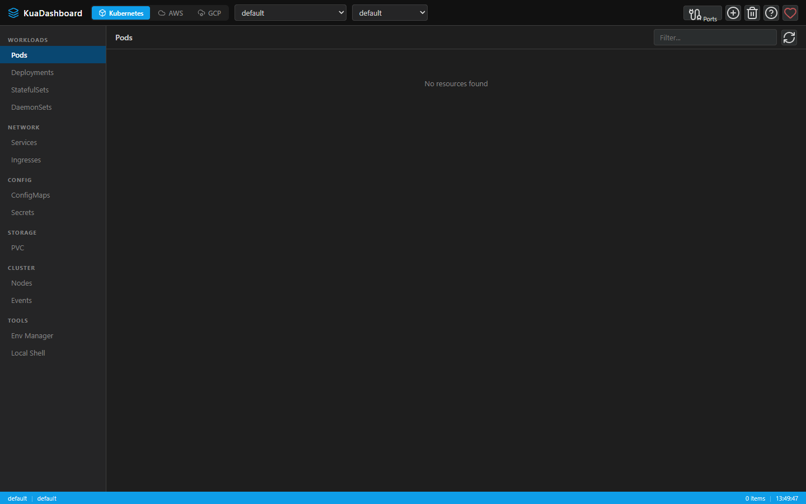
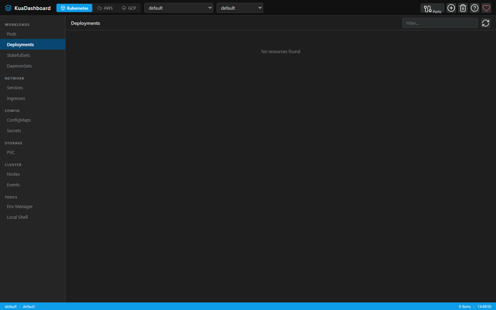

# KUA — Know Unified Administration

> **K**now · **U**nified · **A**dministration

Idioma: [English](README.md) · Español

[](https://github.com/lnavarrocarter/kuadashboard/releases/latest)
[](https://github.com/lnavarrocarter/kuadashboard/actions/workflows/electron-build.yml)
[](https://github.com/lnavarrocarter/kuadashboard/stargazers)
[](https://github.com/lnavarrocarter/kuadashboard/forks)
[](docs/es/index.md)
[](https://github.com/sponsors/lnavarrocarter)
[](https://paypal.me/NavarroCarter)

KUA es una plataforma open source para observar y operar infraestructura distribuida en Kubernetes y varios proveedores cloud. Reúne inventario, actividad, logs y arquitectura de aplicaciones en una sola interfaz.

Para desarrolladores y equipos DevOps/SRE que administran Kubernetes, AWS, GCP o Vercel y necesitan consultar sus entornos sin cambiar continuamente de consola.

**[Descargar para escritorio](https://github.com/lnavarrocarter/kuadashboard/releases/latest)** · [Documentación ES](docs/es/index.md) · [Instalar desde código](#modo-web)

## Primera prueba

1. Descarga e instala el paquete de tu sistema desde Releases. La aplicación de escritorio incluye el servidor y no requiere instalar Node.js.
2. Para Kubernetes, usa un kubeconfig de un entorno de pruebas y `kubectl` disponible; para cloud, configura solo el proveedor que quieras consultar y usa permisos de lectura.
3. Selecciona el contexto o perfil y, cuando corresponda, namespace o región. Abre el inventario y el detalle de un recurso existente.
4. Comprueba que puedes consultar sus datos sin errores de autenticación. No ejecutes acciones de escritura en esta primera prueba.

Necesitas acceso a un entorno propio: este recorrido no proporciona una demo pública ni recursos cloud. Las consultas pueden generar cargos del proveedor. Si no aparecen recursos, verifica contexto, namespace, región y permisos antes de cambiar credenciales.

Versión actual: **v1.17.0**. Construido con **Node.js + Express** y **Vue 3 + Vite + Pinia**; disponible como aplicación web o escritorio con Electron para **Windows**, **macOS** y **Linux**.

Consulta el [changelog](docs/changelog.md) para las entregas y el [roadmap](docs/ROADMAP.md) para el backlog y la dirección futura. Las funciones listadas abajo describen el producto disponible; las ideas del roadmap no implican que ya estén implementadas.

## Capturas





---

## ¿Por qué KUA?

| Problema | Solución KUA |
| --- | --- |
| Consolas separadas para cada entorno | Un solo lugar para Kubernetes, AWS, GCP y Vercel |
| Recursos sin contexto de aplicación | KUApps vincula arquitectura, recursos y observabilidad |
| Operación manual repetitiva | Acciones guiadas, consola integrada y recomendaciones con evidencia |

---

## Funcionalidades

### Kubernetes

- Gestión completa: Pods, Deployments, StatefulSets, DaemonSets, ReplicaSets, Jobs, CronJobs, Services, Ingresses, ConfigMaps, Secrets, PVCs, PVs, StorageClasses, Nodes, Events y recursos de policy/RBAC/scheduling/admission
- Tablas con selección múltiple, eliminación masiva y ordenamiento correcto por `Age` usando duración real
- Auto-refresh por vista activa sin perder contexto
- Live log streaming (WebSocket, multi-container) para Pods y workloads (Deployments, StatefulSets, DaemonSets)
- Búsqueda, filtro por fecha y descarga de logs
- Interactive shell (exec) en pods
- Scale, restart, cordon/uncordon, drain con un clic
- Panel lateral de detalle por recurso con YAML estructurado, secciones especializadas, edición de ConfigMaps/Secrets/envs, métricas y eventos relacionados
- YAML viewer/editor con búsqueda confirmada, validación/lint, guardado y autocompletado
- Port-forward visual con resolución de Pods para Services, estado persistente y auto-reconexión
- Soporte multi-contexto y multi-namespace
- Import kubeconfigs desde YAML pegado, archivo local o ruta registrada
- Helm: búsqueda de charts, instalación en el cluster, releases instalados, desinstalación y preset para metrics-server

### AWS

- **Cómputo**: EC2 (start/stop, SSH/RDP persistente en tabs), ECS (clusters, servicios, tareas), EKS, Lambda (invoke)
- **Almacenamiento**: S3 (file browser + download + **crear bucket** + test endpoint), ECR (**deploy directo a Kubernetes**)
- **Red**: VPC (**details panel** — subnets, SGs, route tables, IGWs, NAT GWs), API Gateway (REST & HTTP), CloudFront, Route 53
- **Mensajería & eventos**: EventBridge (reglas + logs), Step Functions (state machines + diagrama visual), Amazon Lex V2 (bots)
- **AI**: Bedrock (foundation models), CloudFormation para stacks de AgentCore
- **Base de datos**: DynamoDB, DocumentDB
- **Analítica & ETL**: Glue, Athena, Data Pipeline
- **Seguridad**: Secrets Manager (import al Env Manager), Cognito (**grupos por user pool**)

### GCP

- **Cómputo**: Cloud Run (start/stop), Cloud Run Jobs (run + historial de ejecuciones), GKE, Compute Engine VMs (start/stop)
- **Base de datos**: Cloud SQL (start/stop), Cloud Spanner (SQL query editor), Firestore (document browser), Memorystore Redis
- **Almacenamiento**: Cloud Storage (file browser + preview + download), Artifact Registry (paquetes)
- **Serverless**: Cloud Functions (invoke + logs)
- **Mensajería**: Pub/Sub Topics, Pub/Sub Subscriptions
- **Seguridad**: Secret Manager (preview + import al Env Manager), Cloud KMS (key rings + crypto keys)
- **Analítica**: BigQuery (SQL query editor + job polling)
- **Flujos de trabajo**: Cloud Workflows (ejecuciones + source viewer)
- **Red**: Cloud DNS (zonas + registros), VPC Networks (redes + subnets)
- **Async**: Cloud Tasks (colas + tareas), Cloud Scheduler (run/pause/resume)
- **DevOps**: Cloud Build (builds + log viewer)
- **Observabilidad**: Cloud Monitoring (alert policies + uptime checks), Cloud Logging (panel de query interactivo)
- **IAM**: Service Accounts (lista paginada + keys)

### 🔐 Env Manager

- Perfiles de credenciales cifradas (AES-256-GCM) para AWS, GCP y genéricos
- Import/Export de archivos `.env`
- Import de secretos directamente desde Secret Manager (AWS y GCP)
- Credenciales seleccionadas persisten entre sesiones

### Vercel, arquitectura y observabilidad

- Vercel: proyectos, despliegues y sus logs.
- KUApps reúne recursos, relaciones, arquitectura y señales de observabilidad por aplicación.
- Resúmenes de Kubernetes, AWS y GCP incluyen Advisor determinista; los logs admiten caché local cifrada, análisis y consultas.
- El servidor MCP permite a clientes compatibles consultar datos y resúmenes de KUA en modo de solo lectura.

### 🖥️ Desktop App (Electron)

- Aplicación nativa para Windows, macOS y Linux
- Auto-inicia el servidor backend
- Auto-update integrado con `electron-updater`
- Interfaz bilingüe EN/ES con cambio reactivo

---

## Arquitectura

El backend Express expone las API locales y conexiones WebSocket; el frontend Vue presenta vistas por proveedor y KUApps. La app Electron empaqueta ambos para escritorio.

---

## Instalación

### Prerrequisitos

- Git y Node.js 22.12+ de la rama 22 LTS, con npm (para instalar desde código)
- Para Kubernetes: `kubectl` configurado con kubeconfig válido (`~/.kube/config`)
- Para AWS: `aws` CLI o credenciales en `~/.aws/`
- Para GCP: `gcloud` CLI autenticado (`gcloud auth application-default login`)

### Modo web

```bash
git clone https://github.com/lnavarrocarter/kuadashboard.git
cd kuadashboard
npm install
npm install --prefix frontend
npm run build:frontend
npm start
# → http://localhost:7190
```

Verifica `http://localhost:7190/api/health` y abre la interfaz en `http://localhost:7190`. Si el puerto está ocupado, detén tu instancia anterior o ejecuta `node server.js` con la variable `PORT` definida en un puerto libre. Si falta la interfaz, vuelve a ejecutar `npm run build:frontend`. Después sigue la primera prueba de solo lectura indicada arriba.

Si el arranque falla con `ENOENT` en el kubeconfig, comprueba que `KUBECONFIG` apunta a un archivo existente o elimina esa variable para usar la configuración predeterminada. Consulta el [registro de validación y línea base](docs/growth-baseline.md) para el entorno probado y las limitaciones.

### Dev (hot-reload)

```bash
npm run dev:full
# backend en :7192, frontend Vite en :7191
```

### App Electron (dev)

```bash
npm run electron:dev
```

### Build de producción

```bash
# Solo frontend
cd frontend && npm run build

# App Electron (macOS)
npm run electron:build:mac

# App Electron (todas las plataformas)
npm run electron:build:all
```

---

## Tests

```bash
cd frontend && npm test
cd .. && npm test
```

---

## Nota de seguridad

- Las credenciales se almacenan cifradas con AES-256-GCM; la clave se deriva de la máquina.
- Los valores de Secrets K8s se muestran como `[REDACTED]` en el YAML viewer.
- El preload de Electron usa `contextBridge` — el renderer nunca accede directamente a Node.js.
- El servidor escucha en `127.0.0.1` por defecto. Configura `KUA_HOST` solo si necesitas exponerlo en una red confiable: la API permite operar sobre los entornos configurados y no sustituye autenticación.

---

## Changelog

La versión actual es **v1.17.0**. Entre las entregas recientes están Cloud Insights y costos de AWS, dashboards de CloudWatch, servicios SQS/SNS/SES, sesiones de consola unificadas, KUApps y análisis inteligente de logs. El [changelog completo](docs/changelog.md) contiene el detalle por versión.

## Roadmap

El backlog activo incluye cerrar brechas de KUA Application, ampliar los adaptadores de arquitectura y avanzar el centro de control con guardas y auditoría. Azure, DigitalOcean, CRD y otras ideas siguen siendo trabajo futuro; consulta el [roadmap actualizado](docs/ROADMAP.md) antes de tratarlas como funciones disponibles.

## Licencia

MIT. [Apoya el proyecto](https://github.com/sponsors/lnavarrocarter/).
