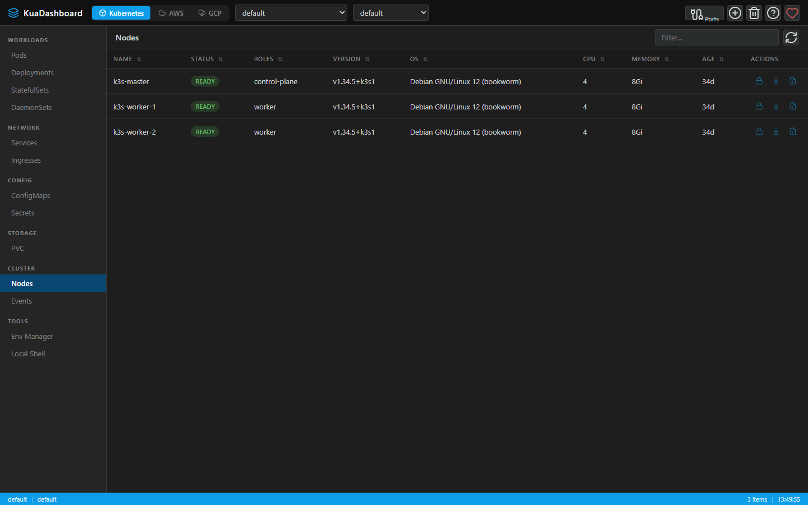

# KUA — Know Unified Administration

> **K**now · **U**nified · **A**dministration

KUA es una plataforma open source para centralizar el conocimiento y la administración de infraestructura distribuida en múltiples entornos cloud y clusters Kubernetes. No es solo un dashboard: **entiende, organiza y permite operar** toda tu infraestructura desde un único punto.

Construido con **Node.js + Express** (backend) y **Vue 3 + Vite + Pinia** (frontend). Disponible como aplicación web o app nativa de escritorio (Electron) para **Windows**, **macOS** y **Linux**.



---

## ¿Por qué KUA?

| Problema | Solución KUA |
|---|---|
| Consolas separadas para AWS, GCP y Kubernetes | **Unificación** — un solo lugar |
| Falta de contexto global entre servicios | **Know** — entiende el estado real |
| Operación manual repetitiva | **Administration** — actúas, no solo observas |
| Difícil trazabilidad entre entornos | Vista cross-cloud con credentials persisted |

---

## Funcionalidades

### ☸️ Kubernetes
- Gestión completa: Pods, Deployments, StatefulSets, DaemonSets, Services, Ingresses, ConfigMaps, Secrets, PVCs, Nodes, Events
- Live log streaming (WebSocket, multi-container)
- Interactive shell (exec) en pods
- Scale, restart, cordon/uncordon, drain con un clic
- YAML viewer/editor con apply
- Port-forward visual con auto-reconexión persistente
- Soporte multi-contexto y multi-namespace
- Import kubeconfigs

### ☁️ AWS — 19 servicios
- **Cómputo**: EC2 (start/stop, SSH), ECS (clusters, servicios, tareas), EKS, Lambda (invoke)
- **Almacenamiento**: S3 (file browser + download), ECR
- **Red**: VPC, API Gateway (REST & HTTP), CloudFront, Route 53
- **Mensajería & eventos**: EventBridge (reglas + logs), Step Functions (state machines + diagrama visual)
- **Base de datos**: DynamoDB, DocumentDB
- **Analítica & ETL**: Glue, Athena, Data Pipeline
- **Seguridad**: Secrets Manager (import al Env Manager), Cognito

### 🌐 GCP — 25 servicios
- **Cómputo**: Cloud Run (start/stop), Cloud Run Jobs (run + historial de ejecuciones), GKE, Compute Engine VMs (start/stop)
- **Base de datos**: Cloud SQL (start/stop), Cloud Spanner (SQL query editor), Firestore (document browser), Memorystore Redis
- **Almacenamiento**: Cloud Storage (file browser + preview + download), Artifact Registry (paquetes)
- **Serverless**: Cloud Functions (invoke + logs)
- **Mensajería**: Pub/Sub Topics, Pub/Sub Subscriptions
- **Seguridad**: Secret Manager (preview + import al Env Manager), Cloud KMS (key rings + crypto keys)
- **Analítica**: BigQuery (SQL query editor + job polling)
- **Flujos de trabajo**: Cloud Workflows (ejecuciones + source viewer)
- **Red**: Cloud DNS (zonas + registros), VPC Networks (redes + subnets)
- **Async**: Cloud Tasks (colas + tareas), Cloud Scheduler (run/pause/resume)
- **DevOps**: Cloud Build (builds + log viewer)
- **Observabilidad**: Cloud Monitoring (alert policies + uptime checks), Cloud Logging (panel de query interactivo)
- **IAM**: Service Accounts (lista paginada + keys)

### 🔐 Env Manager
- Perfiles de credenciales cifradas (AES-256-GCM) para AWS, GCP y genéricos
- Import/Export de archivos `.env`
- Import de secretos directamente desde Secret Manager (AWS y GCP)
- Credenciales seleccionadas persisten entre sesiones

### 🖥️ Desktop App (Electron)
- Aplicación nativa para Windows, macOS y Linux
- Auto-inicia el servidor backend
- Auto-update integrado con `electron-updater`
- Interfaz bilingüe EN/ES con cambio reactivo

---

## Arquitectura

```
kuadashboard/
├── server.js            # Express + WebSocket API server
├── electron/            # Electron main + preload (contextBridge)
├── routes/
│   ├── aws.js           # AWS SDK v3 — 19 servicios
│   ├── gcp.js           # GCP REST API — 25 servicios
│   ├── helm.js          # Helm releases
│   ├── envManager.js    # Credential profiles CRUD
│   ├── localShell.js    # Local terminal WebSocket
│   └── systemTools.js   # CLI tool detection
├── lib/
│   ├── credentialStore.js  # Encrypted credential vault
│   └── crypto.js           # AES-256-GCM helpers
└── frontend/            # Vue 3 + Vite + Pinia
    └── src/
        ├── App.vue
        ├── components/
        │   ├── cloud/       # AwsView, GcpView, GcsBrowser…
        │   └── modals/      # HelpModal, WelcomeModal, FileViewerModal…
        ├── stores/          # useKubeStore, useAwsStore, useGcpStore, useUpdateStore…
        ├── composables/     # useApi, useToast, useChangelog, useTerminalStreams…
        └── locales/         # en.js, es.js
```

---

## Instalación

### Prerrequisitos

- Node.js ≥ 18 (recomendado: 20+)
- `kubectl` configurado con kubeconfig válido (`~/.kube/config`)
- Para AWS: `aws` CLI o credenciales en `~/.aws/`
- Para GCP: `gcloud` CLI autenticado (`gcloud auth application-default login`)

### Modo web

```bash
git clone https://github.com/lnavarrocarter/kuadashboard.git
cd kuadashboard
npm install
cd frontend && npm install && cd ..
npm start
# → http://localhost:7190
```

### Dev (hot-reload)

```bash
npm run dev:full
# backend en :7192, frontend Vite en :7191
```

### App Electron (dev)

```bash
npm run electron:dev
```

### Build de producción

```bash
# Solo frontend
cd frontend && npm run build

# App Electron (macOS)
npm run electron:build:mac

# App Electron (todas las plataformas)
npm run electron:build:all
```

---

## Tests

```bash
cd frontend && npm test
# 111 tests — useGcpStore, useKubeStore, usePortForwardStore, useTerminalStore…
```

---

## Nota de seguridad

- Las credenciales se almacenan cifradas con AES-256-GCM; la clave se deriva de la máquina.
- Los valores de Secrets K8s se muestran como `[REDACTED]` en el YAML viewer.
- El preload de Electron usa `contextBridge` — el renderer nunca accede directamente a Node.js.
- Usar en red local o detrás de autenticación — el servidor expone acceso total al kubeconfig.

---

## Licencia

MIT — Construido con ❤️ y mantenido en tiempo libre.  
[¿Te resulta útil? Considera apoyar el proyecto →](https://github.com/sponsors/lnavarrocarter/)

## Getting Started

### Backend
```bash
npm install
node server.js        # → http://localhost:7190
```

### Frontend (Vue dev server)
```bash
cd frontend
npm install
npm run dev           # → http://localhost:7191
```

### Production build
```bash
cd frontend
npm run build         # outputs to frontend/dist/
```

## Requirements

- Node.js >= 16
- kubectl / kubeconfig configured


Admin web de Kubernetes estilo Lens – ligero, dark-mode, sin dependencias de frontend.

## Características

| Función | Recursos |
|---|---|
| **Ver / filtrar** | Pods, Deployments, StatefulSets, DaemonSets, Services, Ingresses, ConfigMaps, Secrets, PVCs, Nodes, Events |
| **Reiniciar** | Deployments, StatefulSets |
| **Escalar** | Deployments, StatefulSets |
| **Ver / editar YAML y Apply** | Todos los recursos |
| **Ver logs en tiempo real** | Pods (streaming WebSocket, múltiples containers) |
| **Eliminar** | Todos los recursos |
| **Cordon / Uncordon** | Nodes |
| **Drain** | Nodes (cordon + evict pods) |
| **Múltiples contexts** | Switch de contexto desde la cabecera |
| **Múltiples namespaces** | Selector global (incluye "All namespaces") |

## Requisitos

- Node.js ≥ 16
- `kubectl` configurado con kubeconfig válido (`~/.kube/config`)

## Instalación

```bash
cd kuadashboard
npm install
```

## Uso

```bash
npm start
# Dev (hot-reload):
npm run dev
```

Abre http://localhost:7190

Cambia el puerto con la variable de entorno `PORT`:
```bash
PORT=8080 npm start
```

## Estructura

```
kuadashboard/
├── server.js          # API Express + WebSocket
├── package.json
└── public/
    ├── index.html     # Layout HTML
    ├── styles.css     # Dark theme
    └── app.js         # Lógica de UI (vanilla JS)
```

## Nota de seguridad

- Los valores de Secrets se muestran como `[REDACTED]` en el YAML viewer.
- El servidor expone tu kubeconfig al navegador; úsalo en red local o detrás de autenticación.
