# ▲ Vercel

KUA se integra con Vercel mediante **OAuth**: crea un perfil Vercel desde el Env Manager (icono de llave) y autoriza la cuenta — el token se guarda cifrado localmente. Una vez conectado, todos los módulos de esta sección cargan los datos de tu cuenta/equipo.

> Las capturas siguientes muestran la estructura de cada módulo. Con el perfil conectado, cada vista se rellena con los datos en vivo de tu cuenta.

---

## Proyectos

### Projects

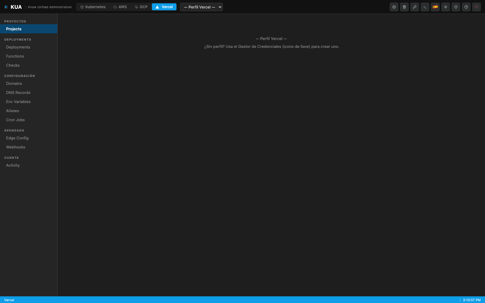

Lista de proyectos con framework, último deployment, estado y enlace directo a la URL en producción.

---

## Deployments

### Deployments

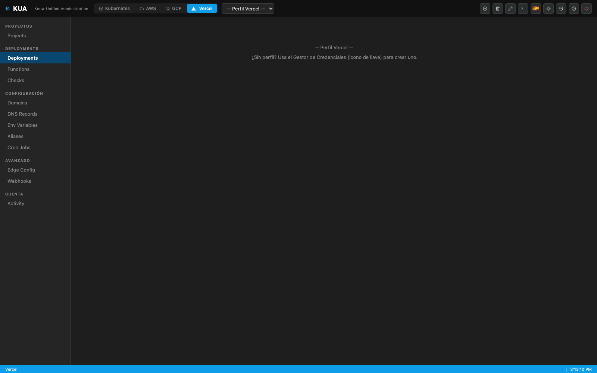

Historial de despliegues por proyecto con estado (Ready/Error/Building), rama, commit y duración.

- **Redeploy** de cualquier deployment anterior.
- **Promote** a producción.
- **Cancel** de builds en progreso.
- **Logs de build en streaming** (SSE) en tiempo real.

### Functions

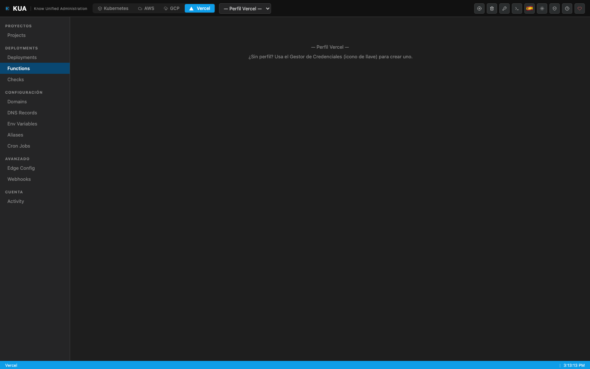

Funciones serverless/edge incluidas en un deployment, con su runtime y región.

### Checks

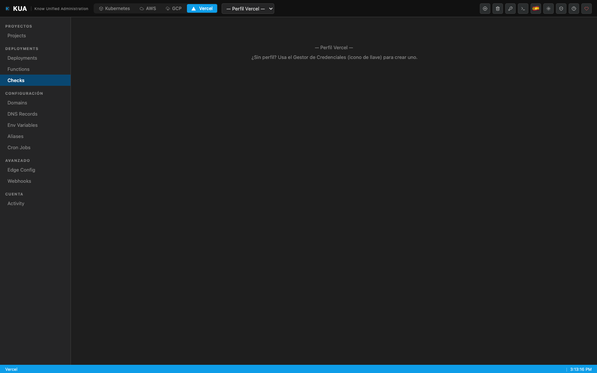

Checks de calidad/CI asociados a cada deployment con estado y conclusión.

---

## Configuración

### Domains

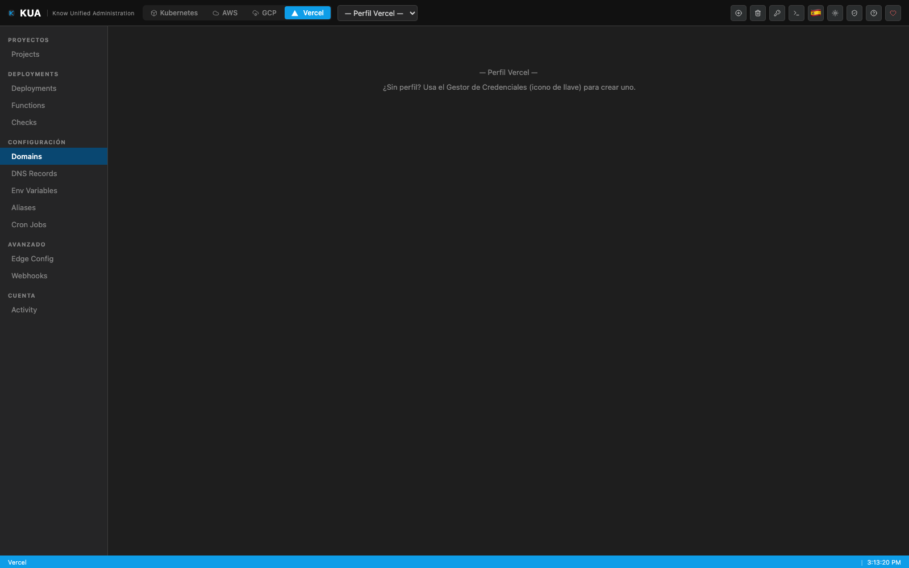

Dominios de la cuenta con verificación y proyecto asignado.

### DNS Records

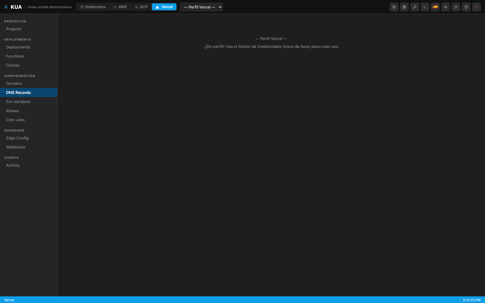

Registros DNS por dominio (A, CNAME, TXT, MX…) con valores y TTL.

### Env Variables

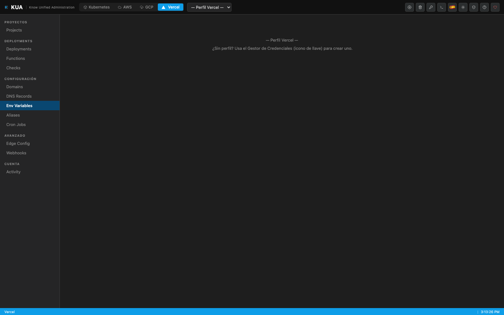

Variables de entorno por proyecto y por entorno (Production / Preview / Development).

### Aliases

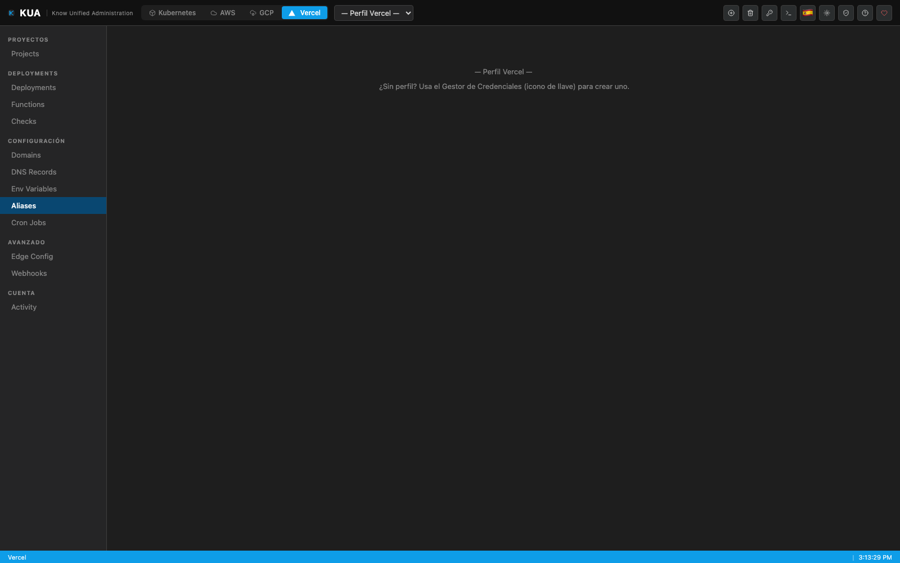

Aliases de URL apuntando a deployments específicos.

### Cron Jobs

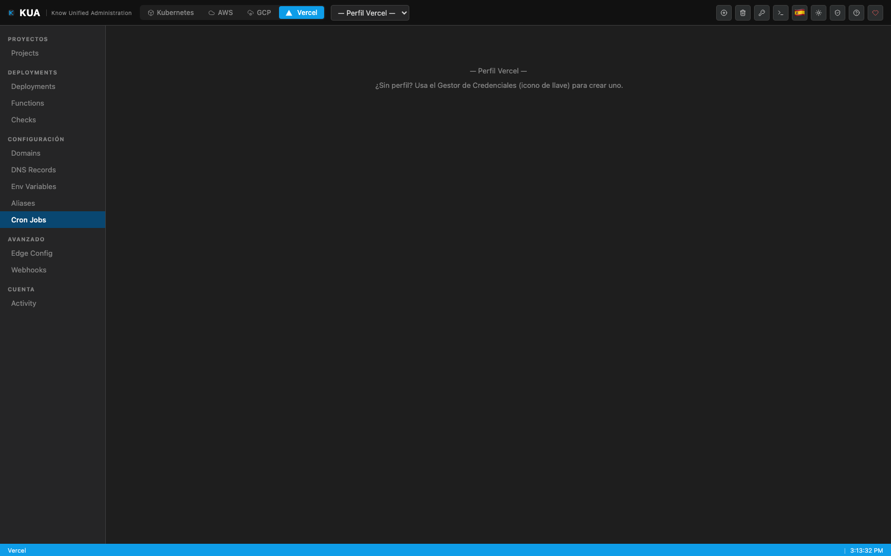

Tareas programadas definidas en los proyectos con su expresión cron y path.

---

## Avanzado

### Edge Config

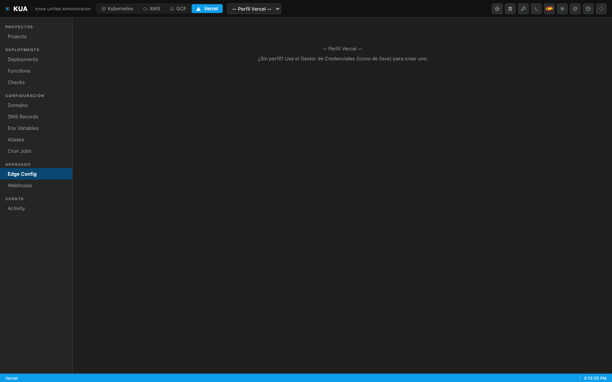

Stores de configuración distribuida en el edge con sus items.

### Webhooks

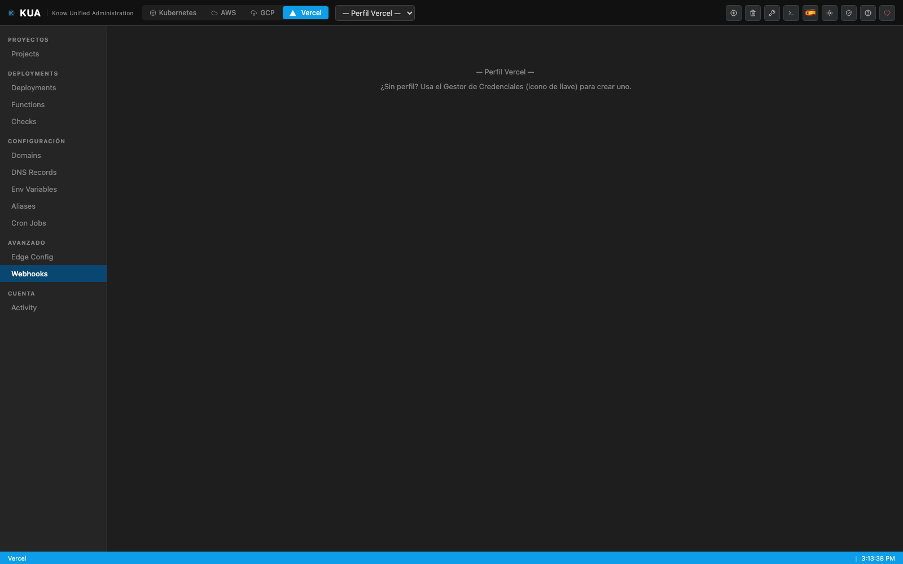

Webhooks configurados con eventos suscritos y URL de destino.

---

## Cuenta

### Activity

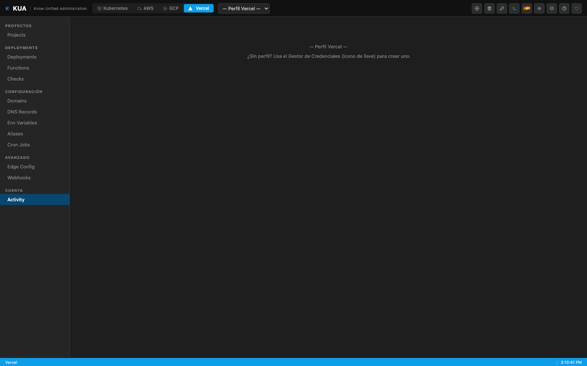

Feed de actividad de la cuenta/equipo: despliegues, cambios de configuración y eventos de miembros.
